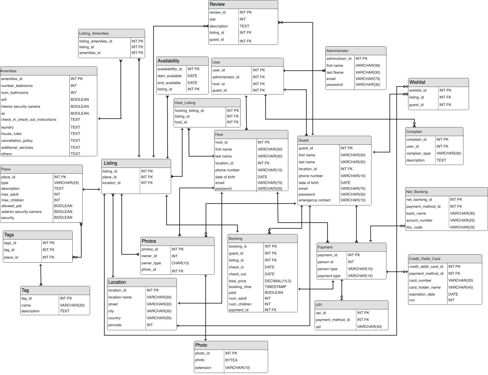

## AirBnB Database

The project involves a comprehensive experience of creating database for an online marketplace for short-and-long-term homestays starting from the creation of proposal, intial ER 
diagram, entities definition, enstablishing structure and relationship between different entities, implementing the refined specification and validate it with test cases which 
encompass different scenario of CRUD operations performed on the database.

We use **PostgreSQL** for this project.

**ER Diagram**
  

**All the sql code for database creation and testing are**
  [here](./Database_Creation_Test.pdf)

**Abstract and the created database statistics are**
  [here](./ABSTRACT_Database_Stats.pdf)

**Database Proposal, Initial ER Diagram and relationship between different entities are**
  [here](./Database_Proposal_And_Initial_Diagram_Structure.pdf)

**Use cases and instruction manaual to use the database are**
  [here](./Use_Case_And_Database_Instruction_Manual.pdf)
